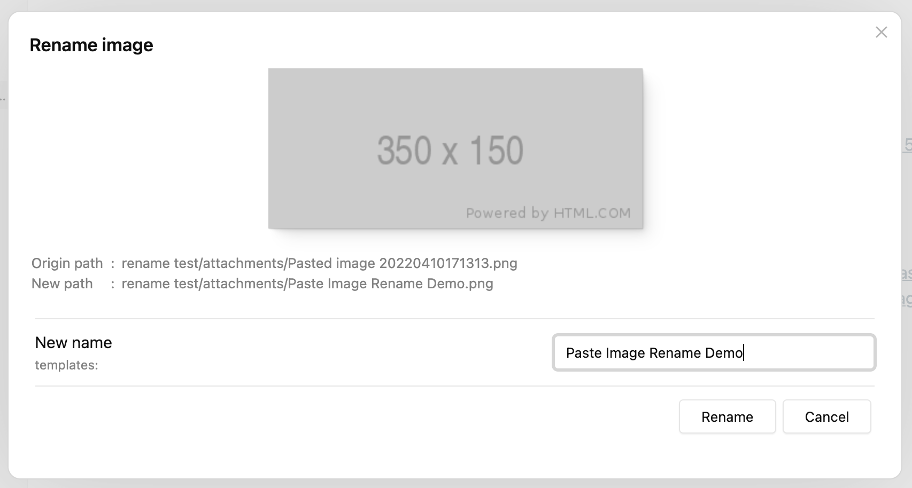
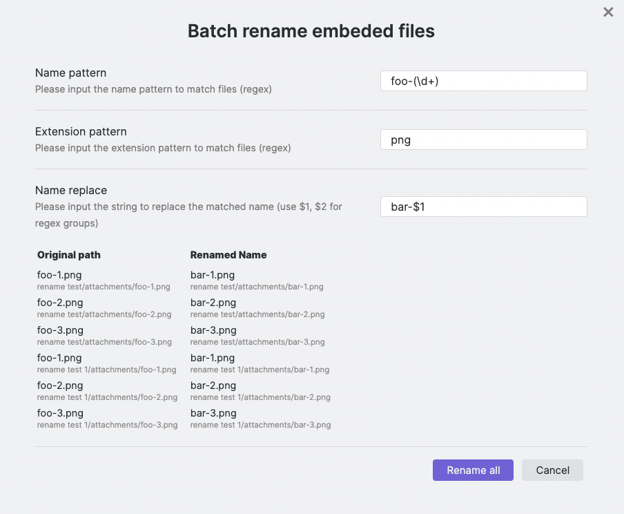

# Paste image rename

Paste image rename renames images and other attachments when they are added to an [Obsidian](https://obsidian.md/) vault.
It can ask for a name, generate one from a pattern, avoid filename collisions, or rename existing embeds in batches.



## Installation

Open **Settings > Community plugins > Browse** in Obsidian, search for **Paste image rename**, then install and enable the plugin.

This repository is a maintenance fork of [reorx/obsidian-paste-image-rename](https://github.com/reorx/obsidian-paste-image-rename).
Obsidian's Community Plugins registry currently points to that upstream repository.
Use the [development setup](CONTRIBUTING.md#develop-in-an-obsidian-vault) when testing a build from this checkout.

## Quick start

1. Open a Markdown note in Obsidian.
2. Paste an image into the note.
3. Enter a filename without the extension, then select **Rename** or press Enter.
4. Open **Settings > Paste image rename** to change the naming pattern or enable automatic renaming.

By default, the plugin handles files whose names begin with `Pasted image `.
Enable **Handle all attachments** to process dragged or copied attachments that keep their original filenames.

## Naming patterns

The default pattern is `{{fileName}}`, which uses the active note's filename without `.md`.

| Variable | Value |
| --- | --- |
| `{{fileName}}` | The active note's filename without the `.md` extension. |
| `{{dirName}}` | The name of the directory that contains the active note. The vault root produces an empty value. |
| `{{firstHeading}}` | The first level-one heading in the active note. |
| `{{imageNameKey}}` | The value of the `imageNameKey` frontmatter property. |
| `{{frontmatter:key}}` | The value of any frontmatter property named `key`. |
| `{{DATE:FORMAT}}` | The current date formatted with a [Moment.js format string](https://momentjs.com/docs/#/displaying/format/). |

For example, this frontmatter supplies `project-photo` to `{{imageNameKey}}`.

```yaml
---
imageNameKey: project-photo
---
```

With the default duplicate delimiter, repeated names are numbered as follows.

| Pattern | Example results |
| --- | --- |
| `{{fileName}}` | `My note.png`, `My note-1.png`, `My note-2.png`. |
| `{{imageNameKey}}` | `project-photo.png`, `project-photo-1.png`, `project-photo-2.png`. |
| `{{imageNameKey}}-{{DATE:YYYYMMDD}}` | `project-photo-20260813.png`, `project-photo-20260813-1.png`. |

The plugin checks the attachment's directory before renaming.
If the requested name already exists, it uses the next numeric prefix or suffix according to the duplicate-number settings.

## Commands

Open the Obsidian command palette to use either batch command.

- **Batch rename embeded files (in the current file)** previews regular-expression matches and replacement names before asking for confirmation.
- **Batch rename all images instantly (in the current file)** applies the configured image name pattern without a confirmation step.

The second command renames files immediately.
Back up the vault or test the pattern on a disposable note before using it on important attachments.



## Settings

| Setting | Effect |
| --- | --- |
| **Image name pattern** | Defines the generated name without the extension. |
| **Duplicate number at start (or end)** | Places the collision number before the name when enabled and after the name when disabled. |
| **Duplicate number delimiter** | Separates the generated number from the base name. The default is `-`. |
| **Always add duplicate number** | Adds a number even when the unnumbered filename is available. |
| **Auto rename** | Renames attachments without opening the rename prompt when the pattern produces a non-empty name. |
| **Handle all attachments** | Processes newly created non-Markdown attachments, including dragged or copied files. |
| **Exclude extension pattern** | Skips matching extensions when **Handle all attachments** is enabled. The regular expression is tested against the extension without the leading dot. |
| **Disable rename notice** | Suppresses the plugin's successful-rename notice. Obsidian may still show its own link-change notice. |

For example, `docx?|xlsx?|pptx?|zip|rar` excludes common office documents and archives.

## Troubleshooting

### The prompt does not open when I paste a file on Windows

Files copied from Windows File Explorer usually keep their original filename instead of receiving Obsidian's `Pasted image ` prefix.
Enable **Handle all attachments** so the plugin processes those files.

Also check whether **Auto rename** is enabled, because automatic renaming deliberately skips the prompt.

### An attachment was not renamed

Check that a Markdown note is active, the generated pattern is not empty, and the attachment's extension does not match **Exclude extension pattern**.
The exclusion setting only applies when **Handle all attachments** is enabled.

## Contributing

See [CONTRIBUTING.md](CONTRIBUTING.md) for the repository map, local build workflow, validation commands, and release boundaries.

## Licence

This project is licensed under the [MIT License](LICENSE).
